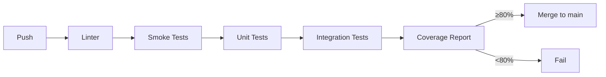

# نضج CI والاختبارات — CI & Test Maturity

> **المجال:** docs/maturity
> **المرحلة:** P9 — النضج والفصل المستقبلي
> **الحالة:** معيار (Criteria)
> **تاريخ الإنشاء:** 2026-08-15
> **المرجع:** `.github/workflows`

---

## 1. الهدف
تعريف مستويات نضج التكامل المستمر (CI) والاختبارات، كشرط مسبق للاستخراج والفصل المستقبلي.

## 2. مستويات النضج
| المستوى | الوصف | الحالة الحالية |
|---|---|---|
| L1 — اختبارات دخان | تحقق نصي لكل مجال | ✓ 12/12 (P3 + استكمال) |
| L2 — اختبارات وحدة | اختبارات دوال الوكلاء/الأدوات | TODO |
| L3 — اختبارات تكامل | اختبار الحلقة الكاملة (P5) | مواصفة ✓، تنفيذ TODO |
| L4 — CI تلقائي | تشغيل تلقائي على كل push | ✓ وظيفة smoke في `.github/workflows/ci.yml` (P9) |
| L5 — تغطية ≥ 80% | تقارير تغطية | TODO |

## 3. خط أنابيب CI المقترح


## 4. اختبارات الدخان الحالية
موجودة في `tests/smoke/run_smoke_tests.py` — تغطي 11 مجالاً (واجهات+سياسات الولايات متوقعة فارغة في P3).

## 5. خارطة طريق النضج
1. **P9** — إضافة اختبارات وحدة (L2) لكل stub.
2. **P9** — تنفيذ اختبار تكامل الحلقة (L3) وفق `runtime/scenarios/single_task_execution.md`.
3. **P9 ✓** — وظيفة CI لتشغيل اختبارات الدخان تلقائيًا (L4).
4. **مستقبلي** — تحسين التغطية إلى 80%+ (L5) كشرط للاستخراج.

## 6. اختبار القبول
```bash
test -f docs/maturity/ci_maturity.md && grep -q "L5" docs/maturity/ci_maturity.md \
  && echo "ci_maturity: OK" || echo "ci_maturity: FAIL"
```
