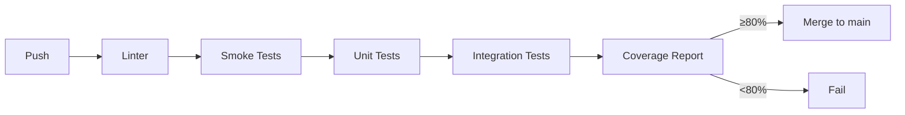

# نضج CI والاختبارات — CI & Test Maturity

> **المجال:** docs/maturity
> **المرحلة:** P9 — النضج والفصل المستقبلي
> **الحالة:** معيار (Criteria)
> **تاريخ الإنشاء:** 2026-08-15
> **المرجع:** `.github/workflows`

---

## 1. الهدف
تعريف مستويات نضج التكامل المستمر (CI) والاختبارات، كشرط مسبق للاستخراج والفصل المستقبلي.

## 2. مستويات النضج
| المستوى | الوصف | الحالة الحالية |
|---|---|---|
| L1 — اختبارات دخان | تحقق نصي لكل مجال | ✓ 12/12 (P3 + استكمال) |
| L2 — اختبارات وحدة | اختبارات دوال الوكلاء/الأدوات | TODO |
| L3 — اختبارات تكامل | اختبار الحلقة الكاملة (P5) | مواصفة ✓، تنفيذ TODO |
| L4 — CI تلقائي | تشغيل تلقائي على كل push | ✓ وظيفة smoke في `.github/workflows/ci.yml` (P9) |
| L5 — تغطية ≥ 80% | تقارير تغطية | ✓ 93.6% أسطر + 80.3% أفرع + بوابة CI (P9) |

## 3. خط أنابيب CI المقترح


## 4. اختبارات الدخان الحالية
موجودة في `tests/smoke/run_smoke_tests.py` — تغطي 11 مجالاً (واجهات+سياسات الولايات متوقعة فارغة في P3).

## 5. خارطة طريق النضج
1. **P9** — إضافة اختبارات وحدة (L2) لكل stub.
2. **P9** — تنفيذ اختبار تكامل الحلقة (L3) وفق `runtime/scenarios/single_task_execution.md`.
3. **P9 ✓** — وظيفة CI لتشغيل اختبارات الدخان تلقائيًا (L4).
4. **P9 ✓** — رفع التغطية إلى ≥80% مع بوابة `fail_under=80` في `pyproject.toml` (L5)، ثم رفع تغطية الأفرع فوق 80% (80.3%) مع بوابة فرع مخصصة في CI.

## 6. اختبار القبول
```bash
test -f docs/maturity/ci_maturity.md && grep -q "L5" docs/maturity/ci_maturity.md \
  && echo "ci_maturity: OK" || echo "ci_maturity: FAIL"
```

## 7. بوابة التغطية (L5)
أُضيف إعداد `[tool.coverage]` إلى `federal/executive/services/pyproject.toml`:

- `source = ["amos_federation"]` — قياس تغطية الحزمة فقط.
- `branch = true` — تفعيل تغطية الأفرع.
- `fail_under = 80` — فشل CI إن هبطت التغطية عن 80%.
- `omit` — استبعاد نقاط الدخول `*/services/*/main.py` و `__main__.py`.
- `exclude_lines` — استبعاد `pragma: no cover` / `pragma: no branch` للمسارات الإنتاجية فقط (Postgres/NATS/jsonschema الاختياري).

### النتائج الحالية (P9 — رفع تغطية الأفرع فوق 80%)
| المؤشر | القيمة |
|---|---|
| اختبارات ناجحة | 672 passed / 8 skipped |
| تغطية الأسطر | 93.6% (4447/4753) |
| تغطية الأفرع | 80.3% (710/884) — فوق هدف 80% |
| بوابة fail_under=80 (أسطر) | PASS |
| بوابة branch coverage ≥ 80% (CI) | PASS — خطوة `Enforce branch coverage` في `ci.yml` |
| وظيفة CI | `coverage` في `.github/workflows/ci.yml` |

#### استراتيجية رفع تغطية الأفرع
1. **اختبارات جديدة للأفرع القابلة للاختبار** — 81 اختبارًا جديدًا يغطي الحالات الحدية:
   - `tests/test_inmemory_stores.py` (32) — مخازن الذاكرة (Vector/Task/State/Knowledge).
   - `tests/test_common_branches.py` (29) — events (verify_chain نجاح/كسر، get_last_chain_hash، publish)، database، auth (require_king/require_role)، event_schemas.
   - `tests/test_durable_bus_branches.py` (11) — publish/poll/ack/replay/list_consumers في DurableEventBus.
   - `tests/test_edge_branches.py` (9) — shadow/model_registry/sandbox/event_wiring.
2. **استبعاد المسارات الإنتاجية فقط** — `# pragma: no branch` / `# pragma: no cover` على فروع تتطلب بنية خارجية غير متوفرة في بيئة الاختبار:
   - مسارات PostgreSQL (database.py، durable_event_bus.py، api_gateway/store.py).
   - مسارات NATS الفعلية (events.py connect/publish/close).
   - مسار jsonschema الاختياري (event_schemas.py).

### تشغيل التغطية محليًا
```bash
cd federal/executive/services
pip install -e ".[dev]"
pytest tests/ --cov --cov-report=term-missing --cov-report=xml
# التحقق من بوابة الأفرع
python -c "import xml.etree.ElementTree as ET; r=ET.parse('coverage.xml').getroot(); print(f'branch: {float(r.get("branch-rate"))*100:.1f}%')"
```
