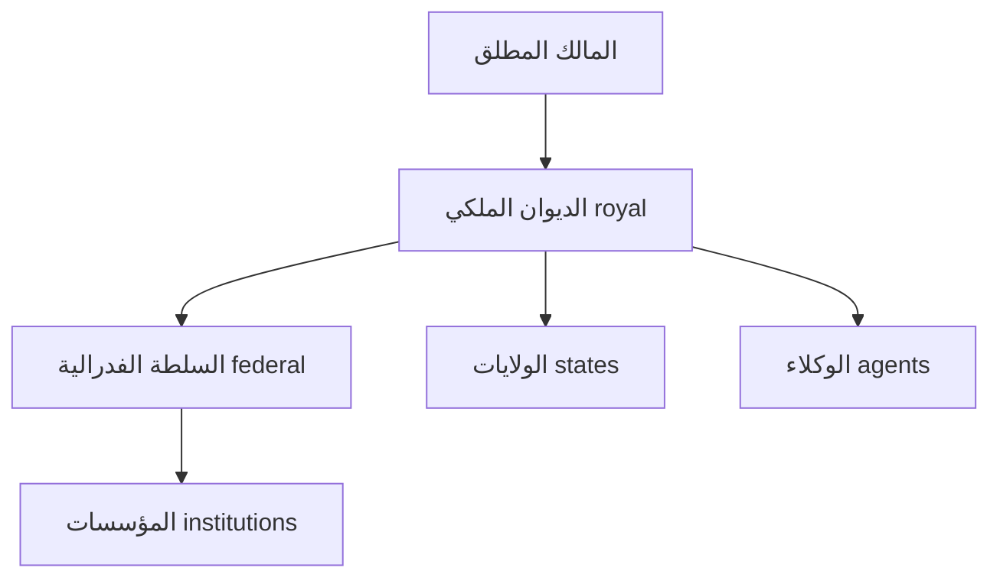

# نموذج الحوكمة طويل الأمد — Long-Term Governance Model

> **المجال:** docs/maturity
> **المرحلة:** P9 — النضج والفصل المستقبلي
> **الحالة:** معيار (Criteria)
> **تاريخ الإنشاء:** 2026-08-15

---

## 1. الهدف
تعريف نموذج الحوكمة الذي يضمن بقاء الدولة وتطورها لـ 100 عام تحت حوكمة بشرية مطلقة، دون انحراف أو انهيار.

## 2. المبادئ الثلاثة
1. **السيادة البشرية المطلقة** — المالك (owner) هو المصدر الأعلى للسلطة؛ لا قرار آلي نهائي بلا موافقة بشرية.
2. **الشفافية الكاملة** — كل فعل مُسجَّل في `event_store` (append-only)، قابل للمراجعة (المادة 009).
3. **الفصل بين السلطات** — تنفيذ (runtime) / تشريع (states/law) / تدقيق (royal) منفصلة.

## 3. هرم الحوكمة


## 4. ضمانات الاستمرارية
| الضمان | الآلية |
|---|---|
| عدم تركز السلطة | الفصل بين السلطات + عزل المستأجرين |
| قابلية التدقيق | event sourcing + audit trail (P5) |
| التعافي من الكوارث | DR playbook (P8) |
| التحكم في الطوارئ | kill-switch (P8) |
| التطور المنضبط | سياسة الإصدار + معايير الاستخراج (P9) |

## 5. التداول الوراثي (Succession)
- آلية تسليم الملكية محفوظة في `ops/continuity/succession/`.
- لا انتقال سلطة بلا مرسوم ملكي مُسجَّل.
- توفير "أرشيف المستقبل" في `ops/continuity/time-capsule/` لضمان استمرار المعرفة.

## 6. مبدأ عدم الانحراف
أي تعديل للدستور (ARCHITECTURE.md) أو العقود يتطلب:
1. مرسوم ملكي من المالك.
2. توثيق في `docs/adr/` (قرار عمارة — ADR).
3. تحديث `EXECUTION_PLAN.md` في نفس الـ commit.

## 7. اختبار القبول
```bash
test -f docs/maturity/long_term_governance.md && grep -q "100 عام" docs/maturity/long_term_governance.md \
  && echo "long_term_governance: OK" || echo "long_term_governance: FAIL"
```
