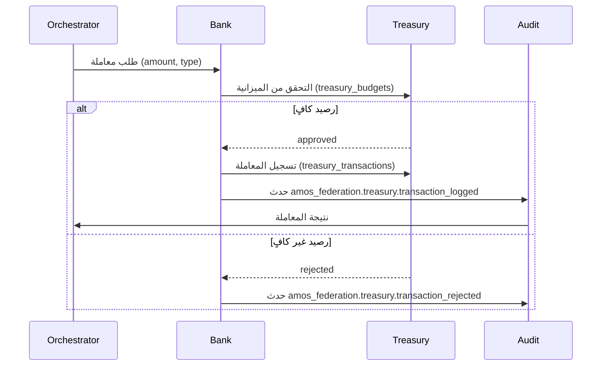

# تدفق البنك — معاملات الخزانة

> **المجال:** institutions/bank
> **المرحلة:** P6 — تفعيل المؤسسات والولايات
> **الحالة:** مواصفة تدفق (Flow Spec)
> **تاريخ الإنشاء:** 2026-08-15
> **الجداول:** `treasury_transactions` · `treasury_budgets` · `treasury_reports`

---

## 1. الهدف
تفعيل البنك المركزي: صرف، تحويل، واعتماد المعاملات المالية مع ربط الخزانة والتقارير، ضمن حلقة التدقيق الملكي.

## 2. مخطط التدفق (Mermaid)


## 3. الخطوات
1. **طلب المعاملة** — يحدد المبلغ والنوع والجهة المستفيدة.
2. **التحقق من الميزانية** — استعلام `treasury_budgets` للتحقق من الرصيد المتاح.
3. **الاعتماد/الرفض** — يُقبل إن وُجد رصيد كافٍ، يُرفض مع تسجيل السبب.
4. **التسجيل** — كتابة المعاملة في `treasury_transactions` كـ append-only.
5. **التدقيق** — إنشاء `audit_entry` في نفس المعاملة (وفق `royal/specs/audit_trail.md`).
6. **التقرير** — تحديث `treasury_reports` دوريًا (يومي/شهري).

## 4. الجداول المرتبطة
| الجدول | الدور في التدفق |
|---|---|
| `treasury_budgets` | التحقق من الرصيد والحدود |
| `treasury_transactions` | سجل المعاملات (append-only) |
| `treasury_reports` | التقارير المالية الدورية |

## 5. اختبار القبول
```bash
test -f institutions/bank/flow.md && grep -q "treasury_transactions" institutions/bank/flow.md \
  && echo "bank_flow: OK" || echo "bank_flow: FAIL"
```
