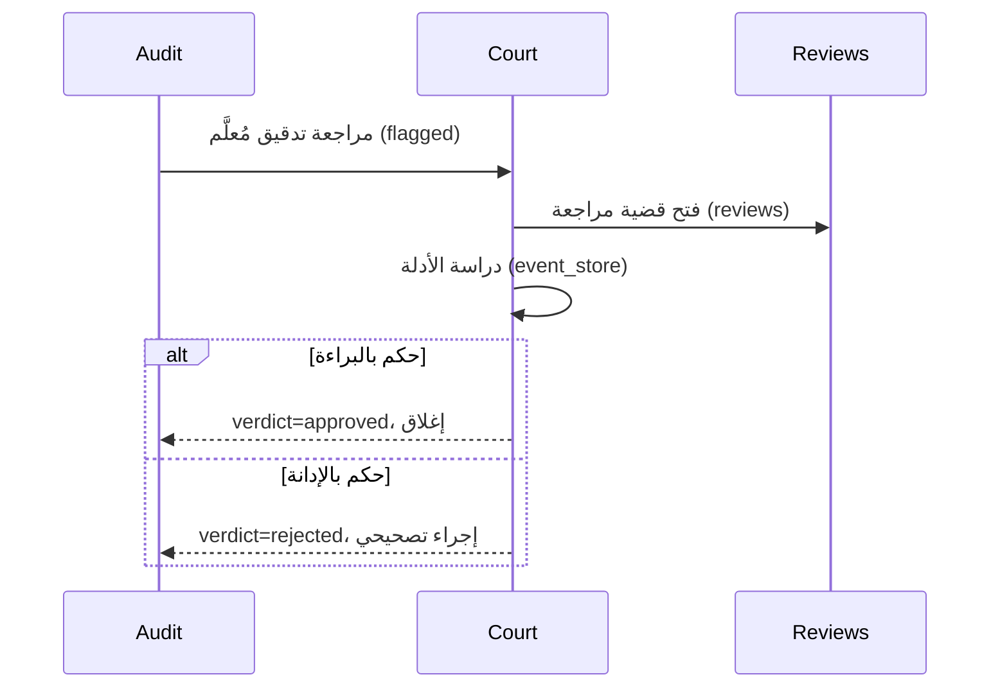

# تدفق المحكمة — المراجعة والأحكام

> **المجال:** institutions/court
> **المرحلة:** P6 — تفعيل المؤسسات والولايات
> **الحالة:** مواصفة تدفق (Flow Spec)
> **تاريخ الإنشاء:** 2026-08-15
> **الجداول:** `reviews` · `audit_entries`

---

## 1. الهدف
تفعيل المحكمة العليا: استقبال التدقيقات المُعلَّمة (flagged)، المراجعة، وإصدار الأحكام.

## 2. مخطط التدفق (Mermaid)


## 3. الخطوات
1. **استقبال القضية** — تدقيق مُعلَّم `flagged` يُحوَّل للمحكمة.
2. **فتح المراجعة** — سجل جديد في `reviews`.
3. **دراسة الأدلة** — استرجاع سلسلة الأحداث من `event_store` (correlation_id).
4. **إصدار الحكم** — `approved` (براءة) أو `rejected` (إدانة مع إجراء تصحيحي).
5. **الإغلاق** — تسجيل الحكم وربطه بالتدقيق الأصلي.

## 4. الجداول المرتبطة
| الجدول | الدور |
|---|---|
| `reviews` | قضايا المراجعة والأحكام |
| `audit_entries` | التدقيق الأصلي المرتبط |
| `event_store` | أدلة السلسلة السببية |

## 5. اختبار القبول
```bash
test -f institutions/court/flow.md && grep -q "reviews" institutions/court/flow.md \
  && echo "court_flow: OK" || echo "court_flow: FAIL"
```
