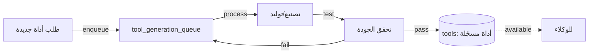

# تدفق المصنع — توليد الأدوات

> **المجال:** institutions/factory
> **المرحلة:** P6 — تفعيل المؤسسات والولايات
> **الحالة:** مواصفة تدفق (Flow Spec)
> **تاريخ الإنشاء:** 2026-08-15
> **الجداول:** `tool_generation_queue` · `tools`

---

## 1. الهدف
تفعيل مصنع الأدوات: استقبال طلبات توليد أدوات جديدة، تصنيعها، وتسجيلها في سجل الأدوات.

## 2. مخطط التدفق (Mermaid)


## 3. الخطوات
1. **طلب الأداة** — يُحدد المواصفات المطلوبة (مدخلات/مخرجات).
2. **الاصطفاف** — يُضاف إلى `tool_generation_queue`.
3. **التصنيع** — توليد الأداة وفق المواصفات.
4. **التحقق** — اختبار جودة الأداة (مدخلات/مخرجات صحيحة).
5. **التسجيل** — الناجحة تُسجَّل في `tools`.
6. **التوفير** — حدث `amos_federation.tool.generated` وتوفيرها للوكلاء.

## 4. الجداول المرتبطة
| الجدول | الدور |
|---|---|
| `tool_generation_queue` | طابور طلبات التوليد |
| `tools` | سجل الأدوات النهائية (10 أدوات) |
| `model_cost_log` | تكاليف التوليد (مرتبط) |

## 5. اختبار القبول
```bash
test -f institutions/factory/flow.md && grep -q "tool_generation_queue" institutions/factory/flow.md \
  && echo "factory_flow: OK" || echo "factory_flow: FAIL"
```
