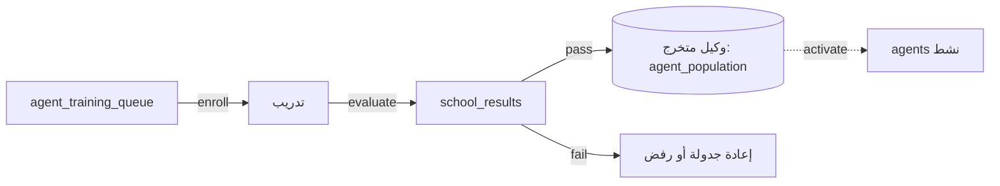

# تدفق الجامعة — تدريب الوكلاء

> **المجال:** institutions/university
> **المرحلة:** P6 — تفعيل المؤسسات والولايات
> **الحالة:** مواصفة تدفق (Flow Spec)
> **تاريخ الإنشاء:** 2026-08-15
> **الجداول:** `school_results` · `agent_training_queue`

---

## 1. الهدف
تفعيل الجامعة: استقبال المرشحين، تدريبهم، تخرّج وكلاء جدد مؤهلين، ضمن دورة حياة الوكيل.

## 2. مخطط التدفق (Mermaid)


## 3. الخطوات
1. **الإ enrolment** — يُضاف المرشح إلى `agent_training_queue`.
2. **التدريب** — تنفيذ وحدات المنهج (معرفة + مهارات).
3. **التقييم** — تسجيل النتائج في `school_results`.
4. **التخرّج** — الناجح يُضاف إلى `agent_population` كوكيل نشط.
5. **التفعيل** — حدث `amos_federation.agent.activated`.
6. **الإعادة/الرفض** — الراسب يُعاد جدولته أو يُرفض حسب الأداء.

## 4. الجداول المرتبطة
| الجدول | الدور |
|---|---|
| `agent_training_queue` | طابور المرشحين للتدريب |
| `school_results` | نتائج التقييم |
| `agent_population` | مخرج التخرّج (وكيل نشط) |

## 5. اختبار القبول
```bash
test -f institutions/university/flow.md && grep -q "school_results" institutions/university/flow.md \
  && echo "university_flow: OK" || echo "university_flow: FAIL"
```
