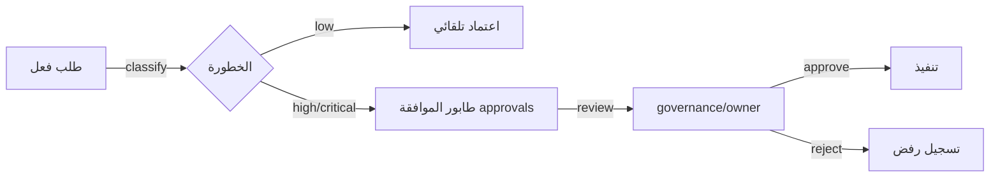

# بروتوكول عتبات الموافقة — Approval Thresholds

> **المجال:** royal/governance
> **المرحلة:** P8 — الحوكمة والأمن والمراقبة
> **الحالة:** بروتوكول (Protocol)
> **تاريخ الإنشاء:** 2026-08-15
> **الجداول:** `approvals` · `audit_entries` · `reviews`

---

## 1. الهدف
تعريف عتبات الموافقة الملكية: متى يتطلب الفعل موافقة الحوكمة، ومن يملك صلاحية الاعتماد حسب درجة الخطورة.

## 2. عتبات الموافقة حسب الفعل
| الفعل | الخطورة | العتبة | المعتمد |
|---|---|---|---|
| تنفيذ أداة منخفضة الخطورة | low | تلقائي | — |
| تنفيذ أداة عالية الخطورة | high | موافقة مسبقة | governance |
| عزل وكيل صحيًا | critical | موافقة فورية | royal/security + governance |
| معاملة مالية > حد البند | high | موافقة مسبقة | treasury + governance |
| إنشاء/تعديل قانون | critical | مرسوم ملكي | owner |
| تفعيل kill-switch | critical | موافقة المالك | owner |

## 3. دورة الموافقة


## 4. ضمانات
1. لا فعل عالي الخطورة بلا `approval_id`.
2. الموافقة منفصلة عن التنفيذ (separation of duties).
3. انتهاء صلاحية الموافقة بعد 24 ساعة إن لم تُنفّذ.
4. كل موافقة مُسجَّلة في `approvals` + `audit_entries`.

## 5. اختبار القبول
```bash
test -f royal/governance/approvals/thresholds.md && grep -q "approvals" royal/governance/approvals/thresholds.md \
  && echo "approval_thresholds: OK" || echo "approval_thresholds: FAIL"
```
