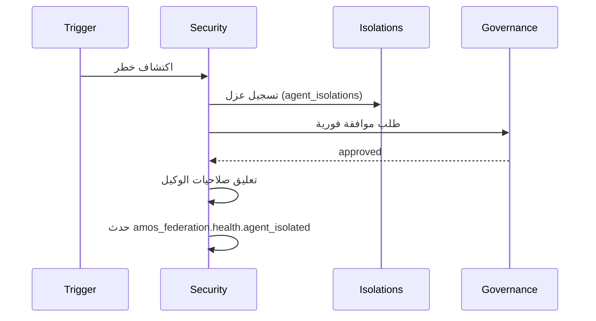

# بروتوكول العزل — Isolation Protocol

> **المجال:** royal/security
> **المرحلة:** P8 — الحوكمة والأمن والمراقبة
> **الحالة:** بروتوكول (Protocol)
> **تاريخ الإنشاء:** 2026-08-15
> **الجداول:** `agent_isolations` · `agent_health_checks`

---

## 1. الهدف
تعريف متى وكيف يُعزل وكيل عن النظام عند اكتشاف خلل أو سلوك مشبوه، مع ضمان قابلية التعافي.

## 2. مسببات العزل
| المسبب | المصدر |
|---|---|
| فشل صحي متكرر | `agent_health_checks` |
| انتهاك حاجز واقٍ | guardrails |
| سلوك مشبوه | event_store (تحليل) |
| أمر ملكي | owner |

## 3. إجراء العزل


## 4. ضمانات
1. العزل لا يحذف الوكيل، يعلّق صلاحياته فقط.
2. كل عزل له سبب مُسجَّل وأجل مراجعة.
3. لا عزل بلا موافقة (إلا في الطوارئ القصوى مع مراجعة لاحقة).
4. مسار التعافي: بعد المعالجة، إعادة تفعيل بمراجعة `states/health`.

## 5. اختبار القبول
```bash
test -f royal/security/isolation/protocol.md && grep -q "agent_isolations" royal/security/isolation/protocol.md \
  && echo "isolation_protocol: OK" || echo "isolation_protocol: FAIL"
```
