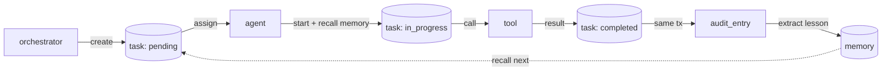

# سيناريو: تنفيذ مهمة واحدة — Single Task Execution Scenario

> **المجالات:** runtime + agents + tools + royal + core
> **المرحلة:** P5 — حلقة التشغيل الأساسية
> **الحالة:** سيناريو مرجعي (Reference Scenario) — أول نبضة قلب للدولة
> **تاريخ الإنشاء:** 2026-08-15
> **المادة الدستورية:** 009 (الشفافية والمراجعة المستمرة)
> **المراجع:** `runtime/specs/task_lifecycle.md` · `runtime/specs/event_logging.md` · `royal/specs/audit_trail.md` · `core/specs/memory_update.md`

---

## 1. الهدف

وصف حلقة كاملة واحدة من حلقة التشغيل الأساسية، من إنشاء المهمة حتى كتابة الذاكرة، ليتحقق تعريف الإنجاز: "حلقة كاملة موثقة وقابلة للتنفيذ. أول نبضة قلب للدولة."

> هذه هي الوحدة المرجعية التي تُقاس عليها كل التدفقات اللاحقة في P6+.

---

## 2. عناصر السيناريو

| العنصر | القيمة | المصدر |
|---|---|---|
| المهمة | `task-492d0c0f120e` | `runtime/stubs/task_event_check.py` |
| نوع المهمة | `event_chain_test` | tasks table |
| الوكيل | وكيل من `agent_population` (342 وكيل) | `agents/stubs/registry_check.py` |
| الأداة | أداة مسجّلة (10 أدوات) | `tools/stubs/registry_check.py` |
| الحارس المراجِع | من `royal_guards` (7 حراس) | `royal/stubs/guard_check.py` |
| الذاكرة | جدول `memories` (2 ذاكرة حاليًا) | `core/stubs/memory_check.py` |

---

## 3. الحلقة الكاملة (The Loop)

### الخطوة 1 — إنشاء المهمة (create)

- المنشئ: `orchestrator`
- الحالة: `pending`
- الحدث: `amos_federation.task.created`
- `correlation_id` = `task-492d0c0f120e` (يُورَّث لكل أحداث السلسلة)

### الخطوة 2 — الإسناد (assign)

- المحرك يختار وكيلًا مؤهلاً من `agent_population` حسب `domain` و`priority`.
- الحالة: `assigned`، `assigned_agent` يُكتب.
- الحدث: `amos_federation.task.assigned`
- `causation_id` = معرّف حدث `task.created`.

### الخطوة 3 — بدء التنفيذ (start)

- الوكيل يسترجع الذكريات ذات الصلة (وفق `core/specs/memory_update.md` §6) ويُضيفها إلى `task.plan` كسياق.
- الحالة: `in_progress`.
- الحدث: `amos_federation.task.started`.

### الخطوة 4 — تنفيذ أداة (tool.executed)

- الوكيل يستدعي أداة مسجّلة من `tools`.
- الحدث: `amos_federation.tool.executed`، `aggregate_id` = معرّف الأداة.
- `causation_id` = معرّف حدث `task.started`.
- الناتج يُكتب في `task.result`.

### الخطوة 5 — الإكمال (complete)

- الحالة: `completed`، `result` محفوظ.
- الحدث: `amos_federation.task.completed`.
- **في نفس المعاملة:** يُنشأ `audit_entry` (وفق `royal/specs/audit_trail.md`).

### الخطوة 6 — التدقيق (audit)

- الحارس المراجِع من `royal_guards` يراجع الحدث.
- `audit_entries.verdict` = `approved` | `flagged`.
- الحدث: `amos_federation.royal.audit_logged`.

### الخطوة 7 — كتابة الذاكرة (memory_written)

- يُستخلص الدرس من `task.result` (وفق `core/specs/memory_update.md` §3).
- يُكتب في `memories` مع `task_id` + `event_id` + `audit_entry_id`.
- الحدث: `amos_federation.core.memory_written`.

---

## 4. مخطط السلسلة الزمنية (Timeline)

```
t0: task.created      (correlation_id = T, causation_id = ∅)
t1: task.assigned     (causation_id = t0)
t2: task.started      (causation_id = t1)
t3: tool.executed     (causation_id = t2)
t4: task.completed    (causation_id = t3)  ──┐
t5: royal.audit_logged(causation_id = t4)   ├─ نفس المعاملة
t6: core.memory_written(causation_id = t5)  ──┘
```

> جميع الأحداث تتشارك `correlation_id = T`، ما يُمكّن إعادة بناء الحلقة كاملة من سجل الأحداث.

---

## 5. رسم الحلقة (Mermaid)



---

## 6. اختبار القبول

```bash
test -f runtime/scenarios/single_task_execution.md \
  && grep -q "core.memory_written" runtime/scenarios/single_task_execution.md \
  && echo "single_task_scenario: OK" || echo "single_task_scenario: FAIL"
```

تعريف الإنجاز: حلقة كاملة (7 خطوات) موثقة + سلسلة أحداث سببية + رسم بياني + قابل للتنفيذ على بنية `tasks`/`event_store`/`audit_entries`/`memories` الموجودة.
