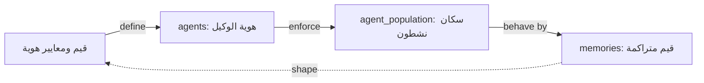

# تدفق الثقافة — معايير الهوية

> **المجال:** states/culture
> **المرحلة:** P6 — تفعيل المؤسسات والولايات
> **الحالة:** مواصفة تدفق (Flow Spec)
> **تاريخ الإنشاء:** 2026-08-15
> **الجداول:** `agents` · `agent_population` · `memories`

---

## 1. الهدف
تفعيل ولاية الثقافة: تعريف معايير هوية الوكلاء والقيم المؤسسية، وضمان اتساق الهوية عبر الدولة.

## 2. مخطط التدفق (Mermaid)


## 3. الخطوات
1. **تعريف القيم** — صياغة معايير الهوية والقيم المؤسسية.
2. **التطبيق** — تضمينها في هوية الوكيل `agents`.
3. **الانتشار** — التزام السكان النشطين `agent_population`.
4. **التراكم** — تجسيد القيم في `memories`.
5. **التعديل** — تغذية راجعة تصوغ القيم عبر الوقت.

## 4. الجداول المرتبطة
| الجدول | الدور |
|---|---|
| `agents` | هوية الوكيل والقيم |
| `agent_population` | السكان النشطون (342) |
| `memories` | القيم المتراكمة |

## 5. اختبار القبول
```bash
test -f states/culture/flow.md && grep -q "agent_population" states/culture/flow.md \
  && echo "culture_flow: OK" || echo "culture_flow: FAIL"
```
