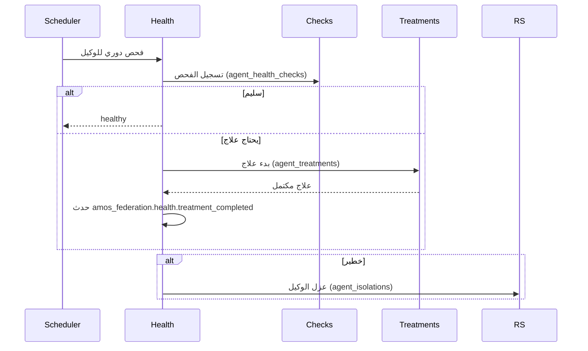

# تدفق الصحة — فحوصات الوكلاء

> **المجال:** states/health
> **المرحلة:** P6 — تفعيل المؤسسات والولايات
> **الحالة:** مواصفة تدفق (Flow Spec)
> **تاريخ الإنشاء:** 2026-08-15
> **الجداول:** `agent_health_checks` · `agent_treatments`

---

## 1. الهدف
تفعيل ولاية الصحة: فحوصات دورية للوكلاء، اكتشاف الأعطال، العلاج، والعزل عند الضرورة.

## 2. مخطط التدفق (Mermaid)


## 3. الخطوات
1. **الفحص الدوري** — جدولة فحص لكل وكيل.
2. **التسجيل** — كتابة النتيجة في `agent_health_checks`.
3. **التشخيص** — سليم / يحتاج علاج / خطير.
4. **العلاج** — إنشاء سجل في `agent_treatments` ومتابعته حتى الاكتمال.
5. **العزل** — عند الخطر، عزل الوكيل في `agent_isolations` (بإذن royal/security).

## 4. الجداول المرتبطة
| الجدول | الدور |
|---|---|
| `agent_health_checks` | سجلات الفحوصات |
| `agent_treatments` | سجلات العلاج |
| `agent_isolations` | العزل الوقائي (royal/security) |

## 5. اختبار القبول
```bash
test -f states/health/flow.md && grep -q "agent_health_checks" states/health/flow.md \
  && echo "health_flow: OK" || echo "health_flow: FAIL"
```
