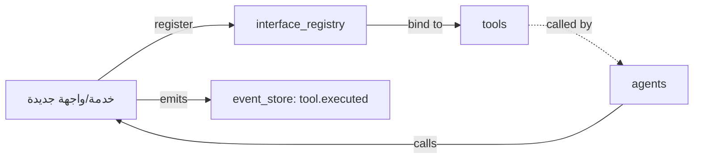

# تدفق البنية التحتية — خارطة الخدمات

> **المجال:** states/infrastructure
> **المرحلة:** P6 — تفعيل المؤسسات والولايات
> **الحالة:** مواصفة تدفق (Flow Spec)
> **تاريخ الإنشاء:** 2026-08-15
> **الجداول:** `interface_registry` · `tools` · `event_store`

---

## 1. الهدف
تفعيل ولاية البنية التحتية: تسجيل وإدارة خارطة الخدمات والواجهات المتاحة للوكلاء والأدوات.

## 2. مخطط التدفق (Mermaid)


## 3. الخطوات
1. **اكتشاف الخدمة** — تعريف خدمة/واجهة جديدة.
2. **التسجيل** — إدراجها في `interface_registry`.
3. **الربط** — ربط الخدمة بالأدوات في `tools`.
4. **التوفير** — توفيرها للوكلاء للاستدعاء.
5. **الرصد** — تسجيل كل استدعاء في `event_store`.

## 4. الجداول المرتبطة
| الجدول | الدور |
|---|---|
| `interface_registry` | سجل الواجهات والخدمات |
| `tools` | الأدوات المرتبطة بالخدمات |
| `event_store` | سجل الاستدعاءات |

## 5. اختبار القبول
```bash
test -f states/infrastructure/flow.md && grep -q "interface_registry" states/infrastructure/flow.md \
  && echo "infrastructure_flow: OK" || echo "infrastructure_flow: FAIL"
```
