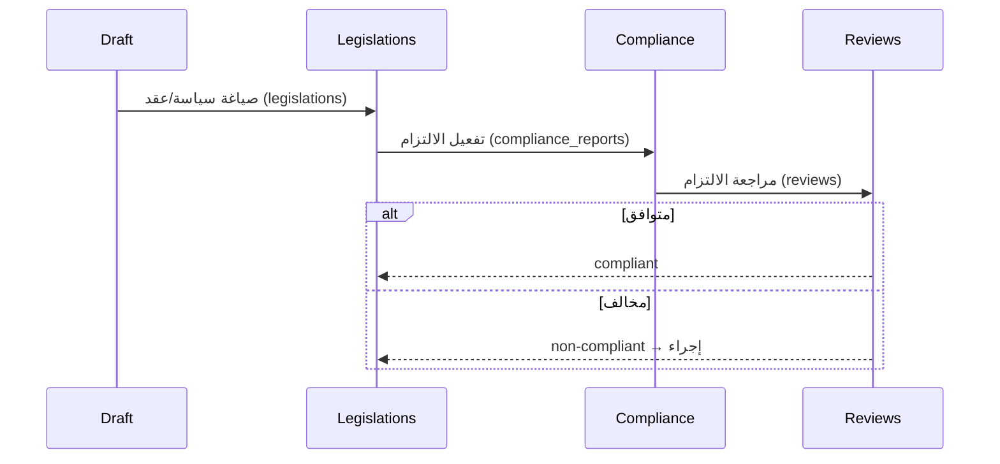

# تدفق القانون — السياسات والعقود

> **المجال:** states/law
> **المرحلة:** P6 — تفعيل المؤسسات والولايات
> **الحالة:** مواصفة تدفق (Flow Spec)
> **تاريخ الإنشاء:** 2026-08-15
> **الجداول:** `legislations` · `compliance_reports` · `reviews`

---

## 1. الهدف
تفعيل ولاية القانون: صياغة السياسات والعقود، إصدارها، وضمان الالتزام بها.

## 2. مخطط التدفق (Mermaid)


## 3. الخطوات
1. **الصياغة** — إعداد السياسة أو العقد.
2. **الإصدار** — تسجيلها في `legislations`.
3. **الالتزام** — مراقبة التطابق في `compliance_reports`.
4. **المراجعة** — مراجعة قضائية في `reviews`.
5. **الإجراء** — عند المخالفة، إجراء تصحيحي.

## 4. الجداول المرتبطة
| الجدول | الدور |
|---|---|
| `legislations` | السياسات والعقود |
| `compliance_reports` | تقارير الالتزام |
| `reviews` | المراجعة القضائية |

## 5. اختبار القبول
```bash
test -f states/law/flow.md && grep -q "legislations" states/law/flow.md \
  && echo "law_flow: OK" || echo "law_flow: FAIL"
```
