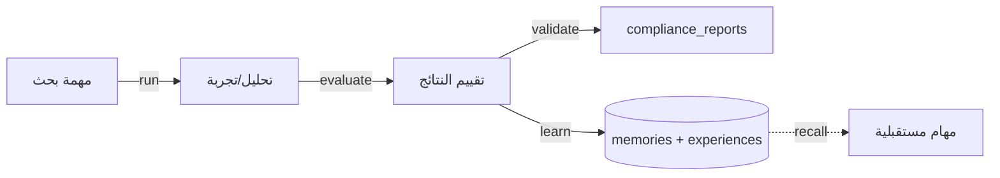

# تدفق العلم — البحث والتقييم

> **المجال:** states/science
> **المرحلة:** P6 — تفعيل المؤسسات والولايات
> **الحالة:** مواصفة تدفق (Flow Spec)
> **تاريخ الإنشاء:** 2026-08-15
> **الجداول:** `compliance_reports` · `memories` · `experiences`

---

## 1. الهدف
تفعيل ولاية العلم: إجراء البحوث، تقييم النتائج، وتحويل المعرفة الجديدة إلى ذاكرة مؤسسية.

## 2. مخطط التدفق (Mermaid)


## 3. الخطوات
1. **مهمة البحث** — تعريف السؤال والفرضية.
2. **التنفيذ** — إجراء التحليل أو التجربة.
3. **التقييم** — تحليل النتائج ومقارنتها بالفرضية.
4. **التحقق** — توثيق التقييم في `compliance_reports`.
5. **التعلّم** — تحويل الدروس إلى `memories` و`experiences`.
6. **الاسترجاع** — توفير المعرفة للمهام المستقبلية.

## 4. الجداول المرتبطة
| الجدول | الدور |
|---|---|
| `compliance_reports` | توثيق نتائج التقييم |
| `memories` | المعرفة المستخلصة |
| `experiences` | الخبرة المتراكمة |

## 5. اختبار القبول
```bash
test -f states/science/flow.md && grep -q "compliance_reports" states/science/flow.md \
  && echo "science_flow: OK" || echo "science_flow: FAIL"
```
